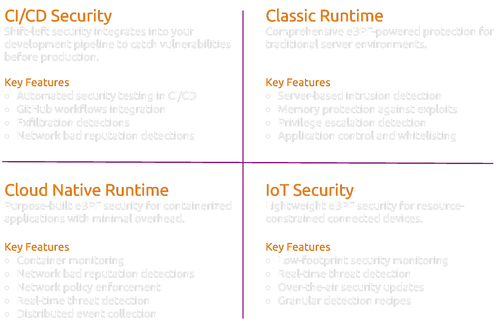

# Jibril

<figure><figcaption></figcaption></figure>

### <mark style="color:yellow;">**Use Cases**</mark>

<figure><figcaption></figcaption></figure>

### <mark style="color:yellow;">What is it ?</mark>

Jibril is a cutting-edge runtime monitoring and threat detection engine, designed to deliver real-time insights with minimal impact on system performance. Powered by eBPF, it remains efficient even under heavy event loads exceeding hundreds of thousands of events per second–delivering real-time protection for modern environments from dev to prod.

### <mark style="color:yellow;">Mission</mark>

* Ensure the security and integrity of your systems at **runtime.**
* Deliver clear and actionable insights

### <mark style="color:yellow;">Insights</mark>

<figure><figcaption>
Deep Visibility on Root Causes
</figcaption></figure>


<mark style="color:yellow;">**Key Benefits**</mark>

* **High Performance**: Maintains efficiency with extensive event loads.
* **Full Visibility**: Tracks all system resources comprehensively.
* **Security**: Ensures robust security and tamper-evident data integrity.
* **Seamless Integration**: Easily integrates with existing infrastructure.


***

### <mark style="color:yellow;">Jibril in less than 5 Minutes</mark>


Install and Configure Jibril in Less than 5 Minutes


***

### <mark style="color:yellow;">Main Features</mark>

Navigate the tabs for the main features.



<mark style="color:yellow;">**Detailed Security Event Information**</mark>

Jibril provides comprehensive tracking across all system resources, including users, processes, files, and network connections. Its query-driven architecture ensures complete visibility and actionable intelligence into system behavior.

<figure><figcaption>
Context Information (OS Package Versions)
</figcaption></figure> <figure><figcaption>
Triggerer Ancestry Visibility FULL File Access History
</figcaption></figure> <figure><figcaption>
Track OS Package Dependencies Versions Detection FULL Context On Demand CVE Warnings
</figcaption></figure>




<mark style="color:yellow;">**Prioritized Detections with Noise Filtering**</mark>

Jibril has an automatic mechanism to reduce noise. Repetitive alerts are filtered by its nature. Some detections are limited by amount of times they happened on the same parent process, some others are limited by amount of times they happened by the same executable path, and so on.





<mark style="color:yellow;">**Inbound and Outbound connections tied to Security Events**</mark>

<figure><figcaption>
Complete View of Remote Peers Per Process Detections are Linked With Corresponding Remote Peer Full DNS Resolution Path per Peer and Flow
</figcaption></figure>

<figure><figcaption>
All Processes Communicating with the same Remote Node Are Grouped All Detections are Flagged on Each Entry (linked with Detections Feature)
</figcaption></figure>



<mark style="color:yellow;">**Network Policy Enforcement**</mark>

<figure><figcaption>
Block Network Connections Using Domains or IP CIDRs. Get Bad Reputation Domains Alerts Realtime.
</figcaption></figure>


