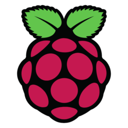

# Requirements

## <mark style="color:yellow;">Linux Distributions</mark>

<figure><figcaption>
Debian
</figcaption></figure> <figure><figcaption>
Ubuntu
</figcaption></figure> <figure><figcaption>
Arch
</figcaption></figure> <figure><figcaption>
Fedora
</figcaption></figure> <figure><figcaption>
Raspbian
</figcaption></figure> <figure><figcaption>
RedHat
</figcaption></figure> <figure><figcaption>
SuSe
</figcaption></figure>

## <mark style="color:yellow;">Virtual Environments</mark>

<figure><figcaption>
OpenStack
</figcaption></figure> <figure><figcaption>
Docker
</figcaption></figure> <figure><figcaption>
Composer
</figcaption></figure> <figure><figcaption>
RedHat Ent Virt
</figcaption></figure> <figure><figcaption>
Incus or LXD
</figcaption></figure> <figure><figcaption>
KVM
</figcaption></figure>

## <mark style="color:yellow;">Cloud Providers</mark>

<figure><figcaption>
Kubernetes
</figcaption></figure> <figure><figcaption>
AWS
</figcaption></figure> <figure><figcaption>
Digital Ocean
</figcaption></figure> <figure><figcaption>
Google Cloud
</figcaption></figure> <figure><figcaption>
Oracle Cloud
</figcaption></figure> <figure><figcaption>
IBM Cloud
</figcaption></figure>

and many others (consult).

## <mark style="color:yellow;">CI/CD plugins</mark>

<figure><figcaption>
GitHub
</figcaption></figure> <figure><figcaption>
Jenkins
</figcaption></figure>

## <mark style="color:yellow;">Linux Requirements</mark>

* Linux Kernel ≥ v6.2 recommended (works with ≥ 5.10)
* x64 Linux OS with eBPF (most current distributions)
* Root privileges with the following capabilities:
  * CAP\_BPF (or CAP\_SYS\_ADMIN if not available)
  * CAP\_PERFMON
  * CAP\_NET\_ADMIN

## <mark style="color:yellow;">Kubernetes Requirements</mark>

* Kubernetes cluster with version 1.16+
* Command `kubectl` configured to communicate with your cluster
